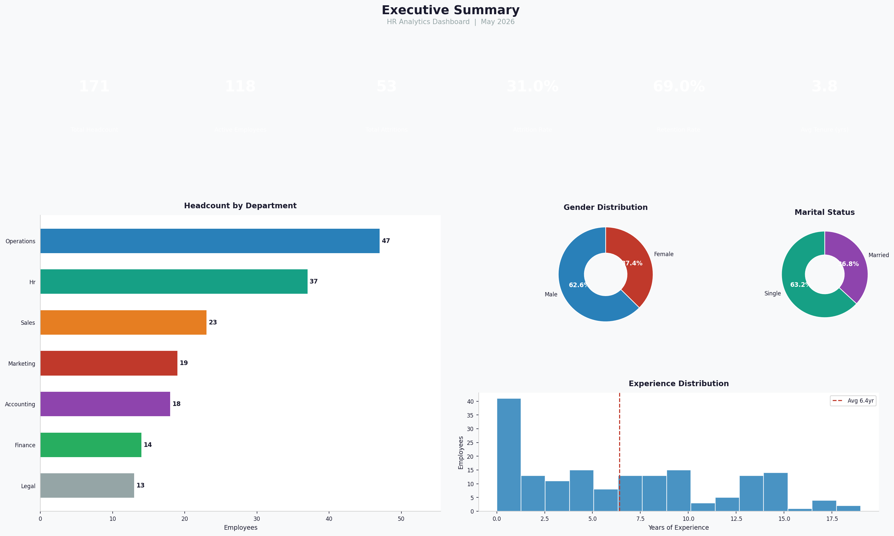
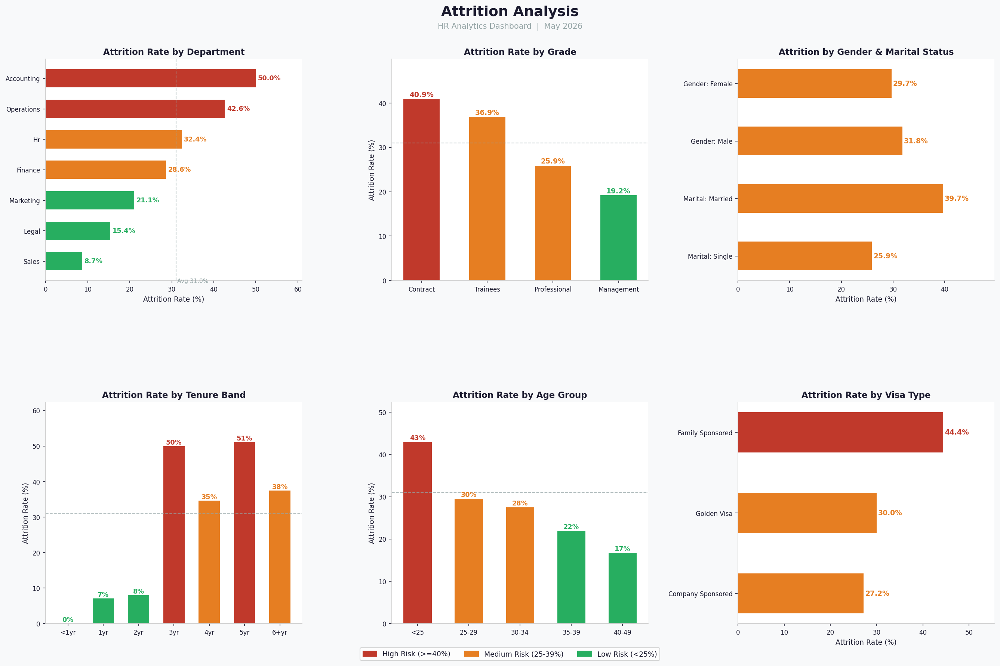
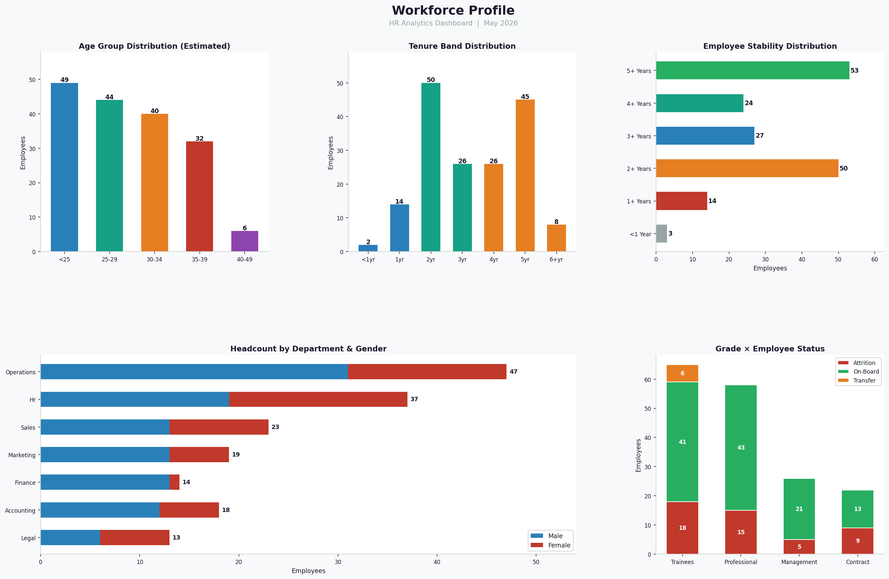
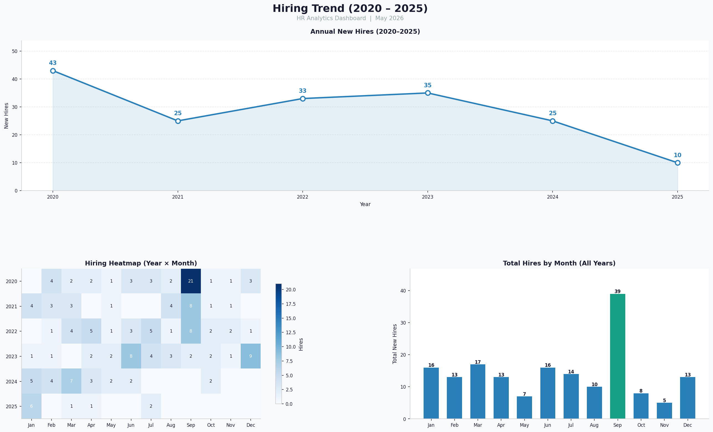
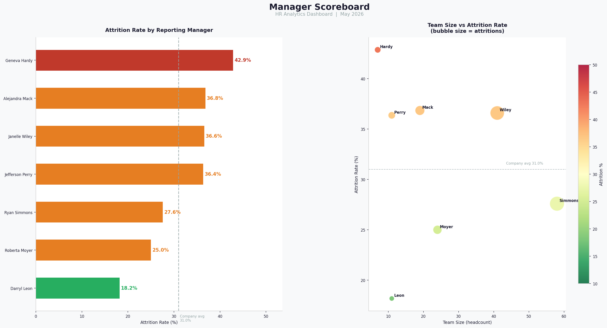

# HR Analytics Business Intelligence Dashboard

<div align="center">



[](https://python.org)
[](https://www.microsoft.com/sql-server)
[](https://powerbi.microsoft.com)
[](https://pandas.pydata.org)
[](https://matplotlib.org)
[](LICENSE)

**A complete end-to-end HR Analytics project - from raw Excel data to executive BI dashboards.**
Built as a professional Data Analyst portfolio project showcasing SQL, Python, and Power BI skills.

</div>

---

## Business Problem

> **"Why are our best employees leaving and which managers, departments, and tenure stages are the biggest risk?"**

HR departments often sit on rich workforce data but lack the tools to turn it into decisions.
This project builds a full analytics pipeline to answer:

| Question | Answer Found |
|---|---|
| What is our overall attrition rate? | **31%** - above the 15-20% industry benchmark |
| Which department loses the most people? | **Accounting (50%)** and **Operations (42.6%)** |
| At what tenure stage do employees quit? | **3-year and 5-year marks** - critical retention windows |
| Which managers have the highest attrition? | Geneva Hardy (43%) vs Darryl Leon (18%) - a 2x gap |
| Does visa type affect retention? | Yes - Family Sponsored (44%) vs Company Sponsored (27%) |
| Is there a gender attrition gap? | Minimal - Male 31.8% vs Female 29.7% |

---

## Dataset

| Property | Value |
|---|---|
| Format | Excel Binary (.xlsb) |
| Rows | **171 employees** |
| Columns | **18 original, 21 after feature engineering** |
| Date Range | February 2020 - July 2025 |
| Status Values | On-Board, Attrition, Transfer |
| Departments | 7 (Operations, HR, Sales, Marketing, Accounting, Finance, Legal) |

### Columns

| Column | Description |
|---|---|
| `employee_status` | On-Board / Attrition / Transfer |
| `gender` | Male / Female (source column was mislabeled "Category") |
| `grade` | Contract / Trainees / Professional / Management |
| `department` | One of 7 business units |
| `total_experience` | Years of prior work experience |
| `visa_type` | Golden Visa / Company Sponsored / Family Sponsored |
| `stability` | Tenure stability band (5+ yrs to <1 yr) |

### Engineered Features

| Feature | Logic |
|---|---|
| `tenure_years` | (Today - Date of Joining) / 365.25 |
| `estimated_age` | total_experience + 23 (proxy - DOB data was unreliable) |
| `age_group` | Binned: <25 / 25-29 / 30-34 / 35-39 / 40-49 |
| `tenure_band` | Binned: <1yr / 1yr / 2yr / 3yr / 4yr / 5yr / 6+yr |
| `is_attrition` | 1 if Attrition or Transfer, 0 if On-Board |

---

## Tech Stack

| Layer | Technology | Purpose |
|---|---|---|
| Data Source | Excel (.xlsb) | Raw HR data |
| Data Cleaning | **Python / Pandas** | ETL pipeline, feature engineering |
| Database | **SQL Server** | Storage, KPI queries, reusable views |
| Visualisation | **Matplotlib / Seaborn** | Dashboard prototype PNGs |
| BI Dashboard | **Power BI Desktop** | Interactive executive dashboard |
| Version Control | **Git / GitHub** | Portfolio publishing |

---

## Project Architecture

```
Raw Excel (.xlsb)
       |
       v
Python ETL Pipeline
  |- pyxlsb  -> reads binary Excel (serial dates fixed manually)
  |- Pandas  -> cleans, renames columns, engineers features
  `- Exports -> hr_cleaned.csv + 8 dimension CSVs
       |
       |-------------------------------|
       v                               v
SQL Server                        Power BI / Matplotlib
  |- Schema creation                |- fact_employees (main table)
  |- BULK INSERT                    |- 8 pre-aggregated dim CSVs
  |- 12 KPI queries                 |- 12 DAX measures
  `- 5 reusable views               `- 5 dashboard pages
```

---

## Key Business Insights

**1. 31% attrition rate** - significantly above the 15-20% industry benchmark.
Urgent retention strategy is needed.

**2. The 3-year and 5-year tenure marks are danger zones** - employees at 3yr (50%) and 5yr (51%)
leave at the highest rates. Structured promotion reviews should target these windows.

**3. Accounting loses 1 in 2 employees (50%)** - the highest of any department.
Investigate workload, compensation, and management practices.

**4. Manager quality explains a 2x attrition gap** - Geneva Hardy's team shows 42.9% attrition
vs Darryl Leon's 18.2%. Leadership coaching has a direct and measurable ROI.

**5. Family Sponsored visa holders leave at 44%** - nearly double the Company Sponsored rate (27%).
A review of visa conversion pathways could significantly improve retention.

**Positive signals:**
- Sales retains 91.3% of staff - best department, study and replicate their practices.
- Management grade retains 80.8% - senior employees are stable once promoted.
- September is the peak hiring month - cycles concentrate in Q3.

---

## Dashboard Screenshots

### Page 1 - Executive Summary
*6 KPI cards, Gender and Marital donuts, Department headcount, Experience distribution*


---

### Page 2 - Attrition Analysis
*Attrition by Department, Grade, Tenure Band, Age Group, Visa Type, Gender - colour-coded red/orange/green*



---

### Page 3 - Workforce Profile
*Age and Tenure distributions, Stability bands, Gender x Department, Grade x Status*



---

### Page 4 - Hiring Trend
*Annual hires line chart, Monthly heatmap, Peak month analysis (2020-2025)*



---

### Page 5 - Manager Scoreboard
*Attrition rate per manager, Bubble chart: team size vs attrition rate*



---

## SQL Analysis

All 12 queries: [`sql/queries/03_hr_kpis.sql`](sql/queries/03_hr_kpis.sql)
5 reusable views: [`sql/views/04_create_views.sql`](sql/views/04_create_views.sql)

```sql
-- Attrition rate by department
SELECT
    department,
    COUNT(*)                                                      AS headcount,
    SUM(is_attrition)                                             AS attritions,
    CAST(AVG(CAST(is_attrition AS FLOAT)) * 100 AS DECIMAL(5,2)) AS attrition_rate_pct
FROM dbo.Employees
GROUP BY department
ORDER BY attrition_rate_pct DESC;
```

```sql
-- Manager scoreboard (teams with 3+ reports)
SELECT
    reporting_manager,
    COUNT(*)                                                      AS team_size,
    SUM(is_attrition)                                             AS attritions,
    CAST(AVG(CAST(is_attrition AS FLOAT)) * 100 AS DECIMAL(5,2)) AS attrition_rate_pct
FROM dbo.Employees
WHERE reporting_manager IS NOT NULL
GROUP BY reporting_manager
HAVING COUNT(*) >= 3
ORDER BY attrition_rate_pct DESC;
```

---

## Python Pipeline

```
python/cleaning/01_load_and_clean.py     # Stage 1 - Load and clean raw data
python/analysis/02_eda_and_kpis.py      # Stage 2 - KPI console report
python/exports/03_export_for_powerbi.py  # Stage 3 - Export 9 CSVs for Power BI
python/analysis/04_dashboard_visuals.py  # Stage 4 - Generate 5 PNG dashboards
```

### Data Cleaning Challenges Solved

| Problem | Solution |
|---|---|
| .xlsb binary format | Used pyxlsb to read raw cell values directly |
| Excel serial dates (e.g. 43950) | Manual: Timestamp("1899-12-30") + Timedelta(days=serial) |
| Category column mislabeled | Renamed to gender - actually stores Male/Female |
| No age column | Derived estimated_age = total_experience + 23 |
| Duplicate stability formula column | Dropped Year formule avancer (copy of Stability) |

---

## Power BI Setup

Full step-by-step guide: [`powerbi/POWERBI_SETUP.md`](powerbi/POWERBI_SETUP.md)
All DAX measures: [`powerbi/dax_measures.md`](powerbi/dax_measures.md)

**Steps:**
1. Get Data -> Text/CSV - load all 9 files from data/exports/
2. Fix column types for fact_employees (dates, integers, decimals)
3. Create _Measures table and paste DAX measures
4. Build 5 pages following the visual layout guide

**Core DAX:**
```
Attrition Rate % = DIVIDE([Total Attritions], [Total Headcount], 0) * 100
Retention Rate % = 100 - [Attrition Rate %]
```

---

## Project Structure

```
hr-analytics/
|-- README.md
|-- requirements.txt
|-- LICENSE
|-- .gitignore
|-- data/
|   |-- processed/hr_cleaned.csv      <- 171 rows x 21 cols, cleaned
|   `-- exports/                      <- 9 Power BI-ready CSVs
|-- python/
|   |-- cleaning/01_load_and_clean.py
|   |-- analysis/02_eda_and_kpis.py
|   |-- analysis/04_dashboard_visuals.py
|   `-- exports/03_export_for_powerbi.py
|-- sql/
|   |-- schema/   <- create tables + bulk insert
|   |-- queries/  <- 12 KPI queries
|   `-- views/    <- 5 reusable views
|-- powerbi/
|   |-- dax_measures.md
|   `-- POWERBI_SETUP.md
`-- screenshots/  <- 5 dashboard PNG exports
```

---

## Quick Start

```bash
git clone https://github.com/ferchichiislem05-boop/hr-analytics.git
cd hr-analytics
pip install -r requirements.txt

# Run KPI report (no raw file needed - cleaned CSV included)
python python/analysis/02_eda_and_kpis.py

# Regenerate dashboard visuals
python python/analysis/04_dashboard_visuals.py
```

To run the full pipeline from raw data:
```bash
python python/cleaning/01_load_and_clean.py
python python/exports/03_export_for_powerbi.py
```

---

## Future Improvements

| Feature | Priority |
|---|---|
| Attrition prediction model (Logistic Regression / Random Forest) | High |
| Power BI date table for YTD, MoM, YoY calculations | High |
| Streamlit web dashboard deployment | Medium |
| Salary analysis - pay vs attrition correlation | Medium |
| Automated weekly KPI email report | Low |

---

## Skills Demonstrated

| Skill | Evidence |
|---|---|
| Data Wrangling | Fixed binary Excel, serial dates, mislabeled columns, 5 derived features |
| SQL Analytics | 12 KPI queries, 5 views, aggregations, HAVING, window-ready patterns |
| Python / Pandas | Full ETL pipeline, date engineering, categorical binning, export automation |
| Data Visualisation | 5-page matplotlib dashboard with professional colour-coding |
| Power BI / DAX | 12 measures, star-schema CSV design, conditional formatting setup |
| Business Thinking | 5 actionable management recommendations derived from data |
| Git / GitHub | Structured repo, .gitignore, professional documentation |

---

## Author

**Islem Ferchichi** - Aspiring Data Analyst | SQL, Python, Power BI

[](https://github.com/ferchichiislem05-boop)
[](mailto:ferchichiislem05@gmail.com)

---

<div align="center">
Built with SQL, Python, and Power BI. If this project helped you, please give it a star!
</div>
